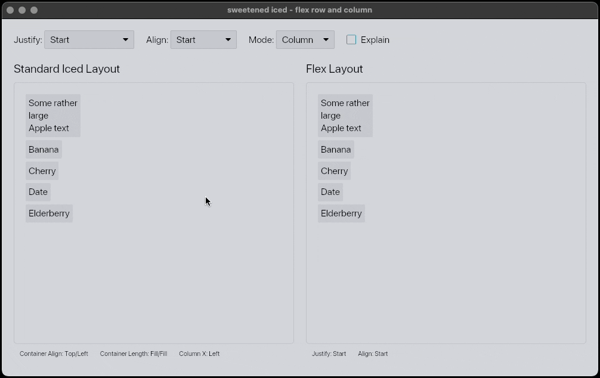

# Examples

- [Mouse Area](#mouse-area)
- [Pick List](#pick-list)
- [Flexbox](#flexbox)

Run any example using:

```bash
cargo run --example <example_name>
```

---

## Mouse Area

Demonstrates the enhanced mouse area widget with click position tracking.

```bash
cargo run --example mouse_area
```

<div align="center">
  
</div>

---

## Pick List

Shows how to use the pick list with disabled items functionality.

```bash
cargo run --example pick_list
```

<div align="center">
  
</div>

---

## Flexbox

Showcases a "full" CSS Flexbox-like implementation for rows and columns, featuring:
- Justify content (start, end, center, space-between, space-around, space-evenly)
- Alignment control (start, end, center, stretch, plus bonus "fit" variants)
- Flexible item sizing with grow/shrink
- Draggable items with live reordering

The example includes a side-by-side comparison with standard `iced` `Row` and
`Column` layouts for reference.

```bash
cargo run --example flexbox
```

<div align="center">
  
</div>