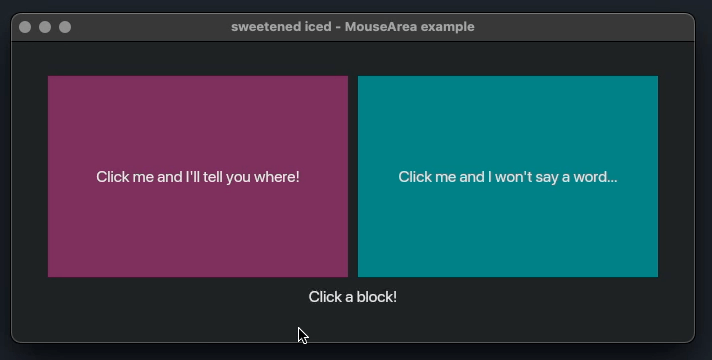
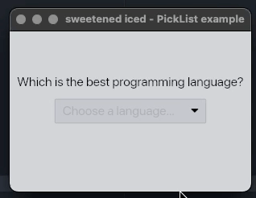

# Examples

- [Mouse Area](#mouse-area)
- [Pick List](#pick-list)

Run any example using:

```bash
cargo run --example <example_name>
```

---

## Mouse Area

Demonstrates the enhanced mouse area widget with click position tracking.

```bash
cargo run --example mouse_area
```

<div align="center">
  
</div>

---

## Pick List

Shows how to use the pick list with disabled items functionality.

```bash
cargo run --example pick_list
```

<div align="center">
  
</div>
